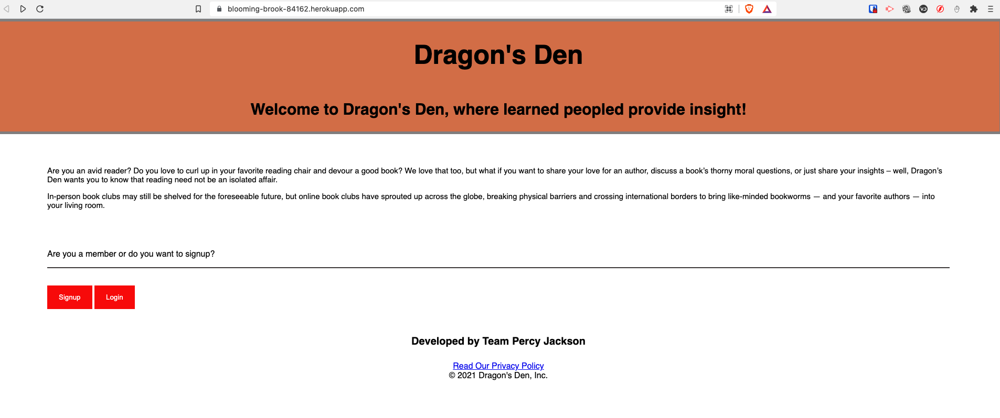
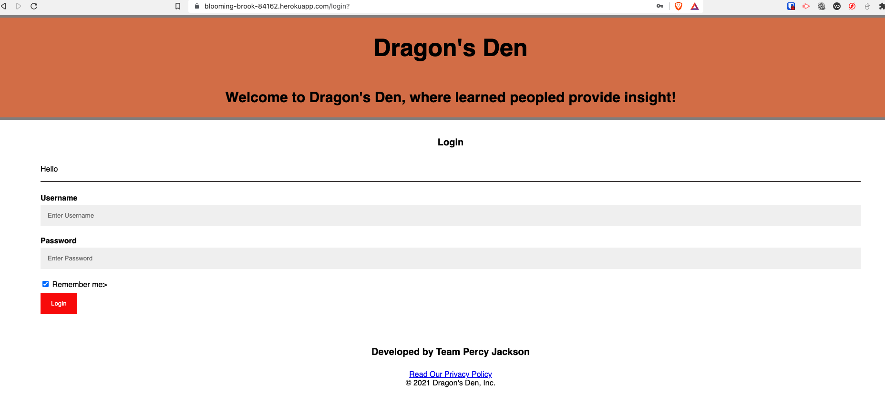
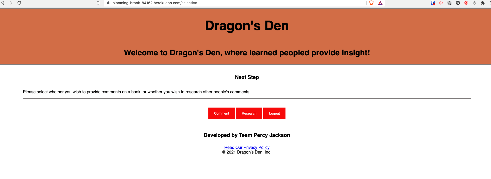
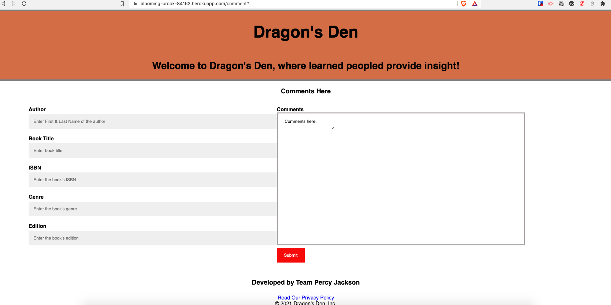

## Welcome to Dragon Den!
Dragon’s Den will be an application that will be used by amateur critics of library clubs. It will be a place where book readers will be able to access basic information of books they have read (i.e. title, author, ISBN, edition, genre, etc.), allowing them to input their critique of the book and rate their experience. Once the comments have been included, the contributor of the comments will be able to save the critique in the database we will create. This critique will then become avaibalew to future users who either wish to read comments and rating made by previous contributors, or add then own comments/critique.

## User Story
As a member of book club, I want to be able to share my comments/critique regarding the books I have read with members of the various book club communities.

## User Experience
WHEN I open the application and reach the landing page,
THEN I am prompted to provide my full name and book club affiliation.
AFTER providing my name and affiliation,
THEN I am asked to determine whether I want to review other member’s critique or add my own.
IF I choose to review other member’s critique,
THEN I am asked for the author or the title of the book,
IF I insert the author,
THEN I am taken to a table which outlines all the books written by that author and I am asked to choose the title of the book I wish to review.
IF I insert the title of the book, then I am taken directly to the page where the basic information of the book is listed along with the critique and ratings.
IF I choose to add my own critique,
THEN I am asked for the author or the title of the book,
IF I insert the author,
THEN I am taken to a table which outlines all the books written by that author and I am asked to choose the title of the book I wish to write a critique about and provide a rating.
IF I insert the title of the book, then I am taken directly to the page where the basic information of the book is listed and asked to provide my own critique and rating.
ONCE I have added my own critique,
THEN I am asked to save the information which will be stored in Dragon’s Den database for posterity.

## Technologies Used
Platforms: VS Code, Github, Heroku
Libraries: Express.js, Node.js, MySQL, Sequelize, Bootstrap, EJS

## Screenshots of Web Application

## Links
Deployed Application: https://blooming-brook-84162.herokuapp.com/
Github Repo: https://github.com/vjain83/dragons-den

